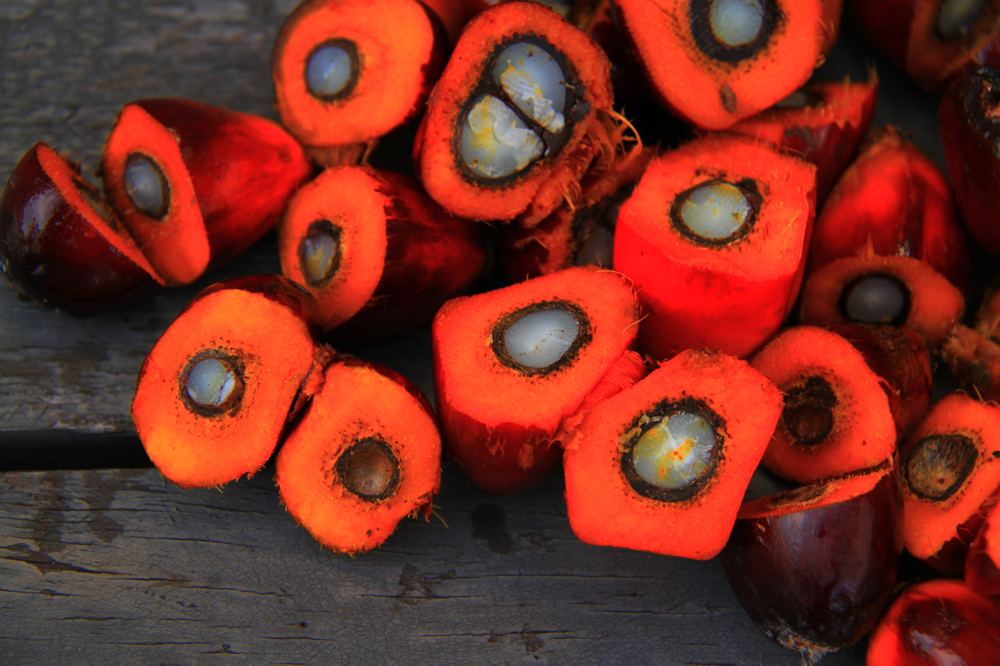

# Palm Olein
analysis and forecasting of palm olein price over time. 

## Business Goals for the project: 
- to understand the long term drivers of price 
- to understand the short term drivers of price and recent volatility
- to accurately forecast short term and long term price movements 

## Hypothesis:
long term prices are driven by both supply and demand factors. 

On the supply side, over the **long term** I expect to see a relationship between price and 
- the total land area under cultivation
- changing production efficiencies per hectare

On the supply side over the **short term** I expect to see fluctuations driven by:
- weather
- abnormal events: war, pandemic, etc
- government export policy

On the **demand** side over the **long term** I expect to see a relationship between price and
- population growth in key import markets: china & india
- economic development (GDP growth of the total economy and per capita) in key import markets: china & india

On the **demand** side over the **short term** I expect to see a relationship between price and
- seasonality around harvests, holidays and other events that the market expects to affect price.
- prices of substitute edible oils
- market sentiment

# Technical Objectives of the project
- Build pipeline to automatically collect, and clean data from a mixture of sources.
- aggregate and save the data to a mariadb database hosted on AWS
- analyse the data to understand long term and short term trends in the palm oil market.
- Build models to infer price of palm oil in the long-, mid-, and short-term time horizons
- Inform decision-making whether to buy or hold at spot, or the forward pricing based on predictions

# Data Collection:
- the Food and Agriculture Organisation (FAO), a part of the UN, has good data. The only issue is that data is mostly 
annual. It is a good source for the long-term data
- **agropost** has free data for daily price movements of palm oil
- **worldometers** has free data for population and economic growth
- **world bank** also has free data for population and economic growth

# Analysis
## The long term palm oil and edible oil markets:
- the demand for edible oil has grown enormously over the last 60 years, driven by population growth and economic development
- production & consumption of palm oil has increased more than other edible oils over the period, due to its favourable production costs, relatively low price and high yield per hectare
- palm olein/oil now accounts for the largest share of edible oil production & consumption.

# Notebook 1: the long term trends the palm oil and vegetable oil markets
- geo plot country-wise consumption of palm oil (cannot easily get data against consumption)
- geo plot country-wise production of palm oil (production is the proxy for consumption)
- or import data for a country (quanbo)
- temperature pallet 
- land cultivation fix
- Total Vegetable oil production by crop fix
- Comparision between veg oil production and land used

## The recent palm oil market:
- labour shortages in 2020 contributed to a supply constrain. Most
  malaysian palm oil plantations rely on indonesian labour. With the COVID lockdowns in 2020 there was annecdotally an
  impact on supply.
- the indonesian government imposed restrictions on exports to control domestic inflation (cost of oil is a key part of
  their "basket of goods" for measuring CPI).
- the dynamics in related markets like soy, linseed, canola, grapeseed, olive oil and other vegetable oils will have a
  bit impact on the price of palm oil.
- Weather will have a big impact on supply of all these

## Notebook #2:
- price of palm oil has increased by 300% in 18 months
- what is driving the current spike in palm oil prices? 
- there are no obvious structural causes
- this analysis considers two possible scenarios (for now): 
  - 1, the current price is a bubble driven by short term supply constrains. If this is the case, there is substantial downside risk for buyers purchasing forward, and for suppliers investing based on current prices and returns.
  - 2, the current price represents a long term shift in the cost structure of palm oil. If this is the case, palm oil loses a significant competitive advantage compared with other edible oils, and there are likely to be profound repercussions for the supply side of the edible oils market.

# Some Hypotheses about market dynamics

## Supply side
- The price dynamic is likely to be driven by the supply side instead of the demand side
  - Amount of land used (the biggest contribution to changes in production volumes)
  - Changes to yield (the second-biggest contributor to changes in production volumes)
  - Disruptions due to COVID-19
  - Disruptions due to the Ukraine conflict (increased fertiliser costs, reduction in supply of sunflower and rapeseed oil)
  - Political policy (Indonesia imposing export bans)

## Demand Side
- Demand side seems to be relatively stable.
- a dispute between malaysia and india let to a shift in demand from malaysia to indonesia.
- the ban on supply to russia will basically kill russian demand.

# current data sources
- food and agriculture organisation
- https://agropost.wordpress.com/2021/12/ for trading price data of palm oil dated back to 2011
